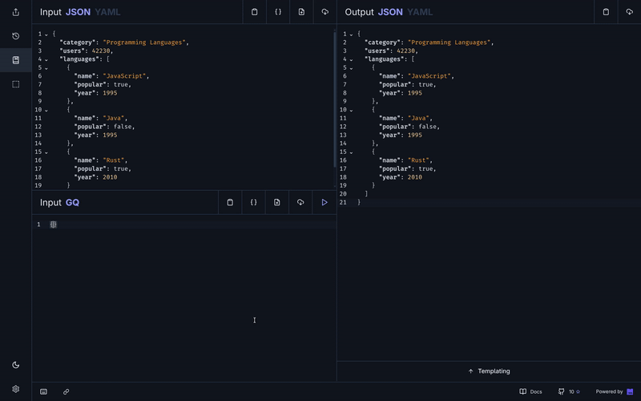

<div align="center"> <h1><strong>GQ</strong></h1> </div>
<div align="center">

_A filtering tool that meets your expectations 🦀✨_



👉 Demo made using our [GQ Playground](https://gq.hermo.dev)

</div>

## 🚀 Overview

GQ is a blazing-fast, open-source filtering tool for JSON and YAML files that includes:

- **Expressive language**: Simple query syntax inspired by GraphQL.
- **Data transformation**: Easily filter, select and reshape your data.
- **Versatile formats**: Works with both JSON and YAML.
- **Modern CLI**: Perfect for developers, software infrastructure architects and automation.
- **Rust-powered**: Built for large-scale data processing.

## 📚 Docs

Find the full documentation, usage examples, and all features at the [GQ Documentation](https://gq.hermo.dev/docs).

## ⚡ Usage

There are two main ways to use GQ:

1. **Online Tool**: Directly in your browser using the fast, WASM-based [GQ Playground](https://gq.hermo.dev).
2. **CLI**: From a command line interface for more demanding usage.

## 🛠️ CLI Installation

**With Cargo:**

```sh
cargo install gq-cli
```

**Arch Linux (AUR):**

```sh
yay -S gq
```

> _Requires [Rust toolchain](https://www.rust-lang.org/tools/install) for Cargo installation._

**From Source:**

```sh
git clone https://github.com/jorgehermo9/gq
cd gq
cargo build --release
./target/release/gq --help
```

## 🤝 Community & Contributions

- Found a bug or have an idea? [Open an issue](https://github.com/jorgehermo9/gq/issues)
- Want to contribute? Pull requests are welcome!
- Join the discussion and help shape the future of GQ.

## 📄 License

This project is licensed under the MIT License.  
See [LICENSE](./LICENSE) for details.
